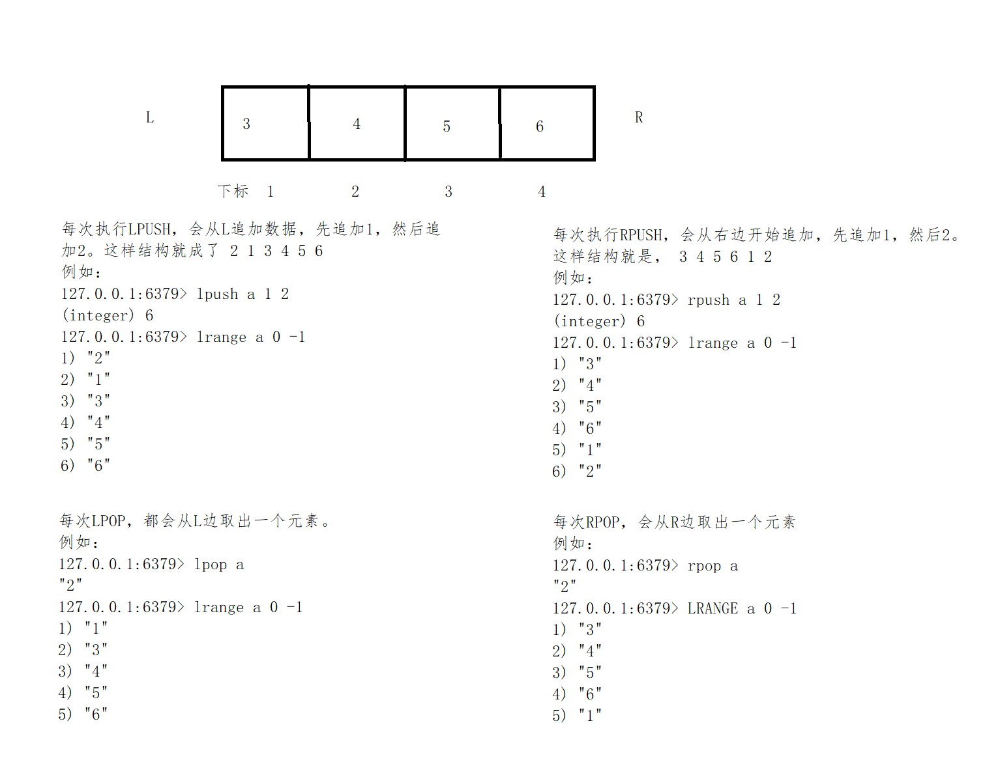

## Redis List操作

#### 1. list结构图



#### 2. **LPUSH key value [value ...]**

- 将一个或多个值 `value` 插入到列表 `key` 的表头
- 如果有多个 `value` 值，那么各个 `value` 值按从左到右的顺序依次插入到表头： 比如说，对空列表 `mylist` 执行命令 `LPUSH mylist a b c` ，列表的值将是 `c b a` ，这等同于原子性地执行 `LPUSH mylist a` 、 `LPUSH mylist b` 和 `LPUSH mylist c` 三个命令。
- 如果 `key` 不存在，一个空列表会被创建并执行 [LPUSH](http://doc.redisfans.com/list/lpush.html#lpush) 操作。
- 当 `key` 存在但不是列表类型时，返回一个错误。

> **当key存在且为list类型时，会追加添加**
>
> ``` 
> 127.0.0.1:6379> lpush a 1 2 3
> (integer) 3
> 127.0.0.1:6379> lrange a 0 -1
> 1) "3"
> 2) "2"
> 3) "1"
> 127.0.0.1:6379> lpush a 4 5 6
> (integer) 6
> 127.0.0.1:6379> lrange a 0 -1
> 1) "6"
> 2) "5"
> 3) "4"
> 4) "3"
> 5) "2"
> 6) "1"
> ```
>
> **当key存在不为list时，会报错**
>
> ```
> 127.0.0.1:6379> set b 1
> OK
> 127.0.0.1:6379> lpush b 2 3 4
> (error) WRONGTYPE Operation against a key holding the wrong kind of value
> ```


#### 3. **LPUSHX key value**

- 将值 `value` 插入到列表 `key` 的表头，当且仅当 `key` 存在并且是一个列表。
- 和 [*LPUSH*](http://doc.redisfans.com/list/lpush.html#lpush) 命令相反，当 `key` 不存在时， [LPUSHX](http://doc.redisfans.com/list/lpushx.html#lpushx) 命令什么也不做。

> **很类似 set 和 setnx。只不过LPUSHX是只有key存在时才会执行操作**
>
> ```
> 127.0.0.1:6379> KEYS a
> (empty list or set)
> 127.0.0.1:6379> lpushx a 1
> (integer) 0
> 127.0.0.1:6379> keys a
> (empty list or set)
> 127.0.0.1:6379> lpush a 1 2 3
> (integer) 3
> 127.0.0.1:6379> lpushx a 4
> (integer) 4
> 127.0.0.1:6379> LRANGE a 0 -1
> 1) "4"
> 2) "3"
> 3) "2"
> 4) "1"
> ```


#### 4. **RPUSH key value [value ...]**

- 将一个或多个值 `value` 插入到列表 `key` 的表尾(最右边)。
- 如果有多个 `value` 值，那么各个 `value` 值按从左到右的顺序依次插入到表尾：比如对一个空列表 `mylist` 执行 `RPUSH mylist a b c` ，得出的结果列表为 `a b c` ，等同于执行命令 `RPUSH mylist a` 、 `RPUSH mylist b` 、 `RPUSH mylist c` 。
- 如果 `key` 不存在，一个空列表会被创建并执行 [RPUSH](http://doc.redisfans.com/list/rpush.html#rpush) 操作。
- 当 `key` 存在但不是列表类型时，返回一个错误。

> **和LPUSH类似，只不过是从列表最右面添加数据**


#### 5. **RPUSHX key value**

- 将值 `value` 插入到列表 `key` 的表尾，当且仅当 `key` 存在并且是一个列表。
- 和 [*RPUSH*](http://doc.redisfans.com/list/rpush.html#rpush) 命令相反，当 `key` 不存在时， [RPUSHX](http://doc.redisfans.com/list/rpushx.html#rpushx) 命令什么也不做。

> **和LPUSHX 类似，也是只有key时，才会添加。是从列表右面开始**


#### 6. **LLEN key**

- 返回列表 `key` 的长度。
- 如果 `key` 不存在，则 `key` 被解释为一个空列表，返回 `0` .
- 如果 `key` 不是列表类型，返回一个错误。

> **返回列表长度**
>
> ```
> 127.0.0.1:6379> rpush a 1 2 3
> (integer) 3
> 127.0.0.1:6379> lrange a 0 -1
> 1) "1"
> 2) "2"
> 3) "3"
> 127.0.0.1:6379> LLEN a
> (integer) 3
> ```
>
> **不存在的key**
>
> ```
> 127.0.0.1:6379> LLEN b
> (integer) 0
> ```
>
> **不是list类型的**
>
> ```
> 127.0.0.1:6379> set c c
> OK
> 127.0.0.1:6379> LLEN c
> (error) WRONGTYPE Operation against a key holding the wrong kind of value
> ```


#### 7. **LRANGE key start stop**

- 返回列表 `key` 中指定区间内的元素，区间以偏移量 `start` 和 `stop` 指定。
- 下标(index)参数 `start` 和 `stop` 都以 `0` 为底，也就是说，以 `0` 表示列表的第一个元素，以 `1` 表示列表的第二个元素，以此类推。
- 你也可以使用负数下标，以 `-1` 表示列表的最后一个元素， `-2` 表示列表的倒数第二个元素，以此类推。
- **注意LRANGE命令和编程语言区间函数的区别**
- 假如你有一个包含一百个元素的列表，对该列表执行 `LRANGE list 0 10` ，结果是一个包含11个元素的列表，这表明 `stop` 下标也在 [LRANGE](http://doc.redisfans.com/list/lrange.html#lrange) 命令的取值范围之内(闭区间)，这和某些语言的区间函数可能不一致，比如Ruby的 `Range.new` 、 `Array#slice` 和Python的 `range()` 函数。
- **超出范围的下标**
- 超出范围的下标值不会引起错误。
- 如果 `start` 下标比列表的最大下标 `end` ( `LLEN list` 减去 `1` )还要大，那么 [LRANGE](http://doc.redisfans.com/list/lrange.html#lrange) 返回一个空列表。
- 如果 `stop` 下标比 `end` 下标还要大，Redis将 `stop` 的值设置为 `end` 。

> ```
> 127.0.0.1:6379> rpush a 1 2 3
> (integer) 3
> 127.0.0.1:6379> lrange a 0 -1
> 1) "1"
> 2) "2"
> 3) "3"
> ```


#### 8. **LSET key index value**

- 将列表 `key` 下标为 `index` 的元素的值设置为 `value` 。
- 当 `index` 参数超出范围，或对一个空列表( `key` 不存在)进行 [LSET](http://doc.redisfans.com/list/lset.html#lset) 时，返回一个错误。
- 关于列表下标的更多信息，请参考 [*LINDEX*](http://doc.redisfans.com/list/lindex.html#lindex) 命令。

> **不存在的key**
>
> ```
> 127.0.0.1:6379> LSET a 1 1
> (error) ERR no such key
> ```
>
> **设置超出 index 范围**
>
> ```
> 127.0.0.1:6379> lpush a 1 2 3
> (integer) 3
> 127.0.0.1:6379> lset a 5 1
> (error) ERR index out of range
> ```
>
> **正常情况**
>
> ```
> 127.0.0.1:6379> lpush a 1 2 3
> (integer) 3
> 127.0.0.1:6379> lset a 0 4
> OK
> 127.0.0.1:6379> lrange a  0 -1
> 1) "4"
> 2) "2"
> 3) "1"
> ```


#### 9. **LTRIM key start stop**

**很像 `SETRANGE`**

- 对一个列表进行修剪(trim)，就是说，让列表只保留指定区间内的元素，不在指定区间之内的元素都将被删除。

- 举个例子，执行命令 `LTRIM list 0 2` ，表示只保留列表 `list` 的前三个元素，其余元素全部删除。

- 下标(index)参数 `start` 和 `stop` 都以 `0` 为底，也就是说，以 `0` 表示列表的第一个元素，以 `1` 表示列表的第二个元素，以此类推。

- 你也可以使用负数下标，以 `-1` 表示列表的最后一个元素， `-2` 表示列表的倒数第二个元素，以此类推。

- 当 `key` 不是列表类型时，返回一个错误。

- [LTRIM](http://doc.redisfans.com/list/ltrim.html#ltrim) 命令通常和 [*LPUSH*](http://doc.redisfans.com/list/lpush.html#lpush) 命令或 [*RPUSH*](http://doc.redisfans.com/list/rpush.html#rpush) 命令配合使用，举个例子：

- ```
  LPUSH log newest_log
  LTRIM log 0 99
  ```

- 这个例子模拟了一个日志程序，每次将最新日志 `newest_log` 放到 `log` 列表中，并且只保留最新的 `100` 项。注意当这样使用 `LTRIM` 命令时，时间复杂度是O(1)，因为平均情况下，每次只有一个元素被移除。

- **注意LTRIM命令和编程语言区间函数的区别**

- 假如你有一个包含一百个元素的列表 `list` ，对该列表执行 `LTRIM list 0 10` ，结果是一个包含11个元素的列表，这表明 `stop` 下标也在 [LTRIM](http://doc.redisfans.com/list/ltrim.html#ltrim) 命令的取值范围之内(闭区间)，这和某些语言的区间函数可能不一致，比如Ruby的 `Range.new` 、 `Array#slice` 和Python的 `range()` 函数。

- **超出范围的下标**

- 超出范围的下标值不会引起错误。

- 如果 `start` 下标比列表的最大下标 `end` ( `LLEN list` 减去 `1` )还要大，或者 `start > stop` ， [LTRIM](http://doc.redisfans.com/list/ltrim.html#ltrim) 返回一个空列表(因为 [LTRIM](http://doc.redisfans.com/list/ltrim.html#ltrim) 已经将整个列表清空)。

- 如果 `stop` 下标比 `end` 下标还要大，Redis将 `stop` 的值设置为 `end` 。

> ```
> 127.0.0.1:6379> rpush a 0 1 2 3 4
> (integer) 5
> 127.0.0.1:6379> LTRIM a 1 2
> OK
> 127.0.0.1:6379> LRANGE a 0 -1
> 1) "1"
> 2) "2"
> ```


#### 10. **LREM key count value**

- 根据参数 `count` 的值，移除列表中与参数 `value` 相等的元素。
- `count` 的值可以是以下几种：
- - `count > 0` : 从表头开始向表尾搜索，移除与 `value` 相等的元素，数量为 `count` 。
  - `count < 0` : 从表尾开始向表头搜索，移除与 `value` 相等的元素，数量为 `count` 的绝对值。
  - `count = 0` : 移除表中所有与 `value` 相等的值。

> **count = 0，清空所有和value情况**
>
> ```
> 127.0.0.1:6379> rpush a 1 w 2 w 3 w 4 w
> (integer) 8
> 127.0.0.1:6379> LREM a 0 w
> (integer) 4
> 127.0.0.1:6379> LRANGE a 0 -1
> 1) "1"
> 2) "2"
> 3) "3"
> 4) "4"
> ```
>
> **count > 0，清空count数量的value。从L开始**
>
> ```
> 127.0.0.1:6379> rpush b w 1 w 2 w 3
> (integer) 6
> 127.0.0.1:6379> LREM b 2 w
> (integer) 2
> 127.0.0.1:6379> LRANGE b 0 -1
> 1) "1"
> 2) "2"
> 3) "w"
> 4) "3"
> ```
>
> **count < 0，清空count绝对值数量的value。从R开始**
>
> ```
> 127.0.0.1:6379> rpush c 1 w 2 w 3 w
> (integer) 6
> 127.0.0.1:6379> lrem c -2 w
> (integer) 2
> 127.0.0.1:6379> LRANGE c 0 -1
> 1) "1"
> 2) "w"
> 3) "2"
> 4) "3"
> ```


#### 11. **LINDEX key index**

- 返回列表 `key` 中，下标为 `index` 的元素。
- 下标(index)参数 `start` 和 `stop` 都以 `0` 为底，也就是说，以 `0` 表示列表的第一个元素，以 `1` 表示列表的第二个元素，以此类推。
- 你也可以使用负数下标，以 `-1` 表示列表的最后一个元素， `-2` 表示列表的倒数第二个元素，以此类推。
- 如果 `key` 不是列表类型，返回一个错误。

> ```
> 127.0.0.1:6379> rpush a 0 1 2 3 4
> (integer) 5
> 127.0.0.1:6379> LINDEX a 2
> "2"
> ```


#### 11. **LINSERT key BEFORE|AFTER pivot value**

- 将值 `value` 插入到列表 `key` 当中，位于值 `pivot` 之前或之后。
- 当 `pivot` 不存在于列表 `key` 时，不执行任何操作。
- 当 `key` 不存在时， `key` 被视为空列表，不执行任何操作。
- 如果 `key` 不是列表类型，返回一个错误。

> **只会匹配第一个，之后有重复的不会继续添加了**
>
> ```
> 127.0.0.1:6379> lrange a 0 -1
> 1) "1"
> 2) "2"
> 3) "3"
> 4) "4"
> 5) "5"
> 6) "4"
> 127.0.0.1:6379> LINSERT a before 4 a
> (integer) 7
> 127.0.0.1:6379> lrange a 0 -1
> 1) "1"
> 2) "2"
> 3) "3"
> 4) "a"
> 5) "4"
> 6) "5"
> 7) "4"
> ```


#### 12. **RPOPLPUSH source destination**

- 命令 [RPOPLPUSH](http://doc.redisfans.com/list/rpoplpush.html#rpoplpush) 在一个原子时间内，执行以下两个动作：
- - 将列表 `source` 中的最后一个元素(尾元素)弹出，并返回给客户端。
  - 将 `source` 弹出的元素插入到列表 `destination` ，作为 `destination` 列表的的头元素。
- 举个例子，你有两个列表 `source` 和 `destination` ， `source` 列表有元素 `a, b, c` ， `destination` 列表有元素 `x, y, z` ，执行 `RPOPLPUSH source destination` 之后， `source` 列表包含元素 `a, b` ， `destination` 列表包含元素 `c, x, y, z` ，并且元素 `c` 会被返回给客户端。
- 如果 `source` 不存在，值 `nil` 被返回，并且不执行其他动作。
- 如果 `source` 和 `destination` 相同，则列表中的表尾元素被移动到表头，并返回该元素，可以把这种特殊情况视作列表的旋转(rotation)操作。

> ```
> 127.0.0.1:6379> rpush a 1 2 3
> (integer) 3
> 127.0.0.1:6379> LRANGE a 0 -1
> 1) "1"
> 2) "2"
> 3) "3"
> 127.0.0.1:6379> LRANGE b 0 -1
> (empty list or set)
> 127.0.0.1:6379> RPOPLPUSH a b
> "3"
> 127.0.0.1:6379> lrange a 0 -1
> 1) "1"
> 2) "2"
> 127.0.0.1:6379> lrange b 0 -1
> 1) "3"
> ```


#### 13. **BLPOP key [key ...] timeout**

- [BLPOP](http://doc.redisfans.com/list/blpop.html#blpop) 是列表的阻塞式(blocking)弹出原语。
- 它是 [*LPOP*](http://doc.redisfans.com/list/lpop.html#lpop) 命令的阻塞版本，当给定列表内没有任何元素可供弹出的时候，连接将被 [BLPOP](http://doc.redisfans.com/list/blpop.html#blpop) 命令阻塞，直到等待超时或发现可弹出元素为止。
- 当给定多个 `key` 参数时，按参数 `key` 的先后顺序依次检查各个列表，弹出第一个非空列表的头元素。

> **线程1**
>
> ```
> 127.0.0.1:6379> blpop a b 1000
> 
> 线程2，添加数据后，获得了结果
> 1) "a"
> 2) "3"
> (11.23s)
> ```
>
> **线程2**
>
> ```
> 127.0.0.1:6379> lpush a 1 2 3
> (integer) 3
> ```


#### 14. **BRPOP key [key ...] timeout**

**和 BLPOP key [key ...] timeout 类似只不过，一个是L方向取，一个是R方向**

- [BRPOP](http://doc.redisfans.com/list/brpop.html#brpop) 是列表的阻塞式(blocking)弹出原语。
- 它是 [*RPOP*](http://doc.redisfans.com/list/rpop.html#rpop) 命令的阻塞版本，当给定列表内没有任何元素可供弹出的时候，连接将被 [BRPOP](http://doc.redisfans.com/list/brpop.html#brpop) 命令阻塞，直到等待超时或发现可弹出元素为止。
- 当给定多个 `key` 参数时，按参数 `key` 的先后顺序依次检查各个列表，弹出第一个非空列表的尾部元素。
- 关于阻塞操作的更多信息，请查看 [*BLPOP*](http://doc.redisfans.com/list/blpop.html#blpop) 命令， [BRPOP](http://doc.redisfans.com/list/brpop.html#brpop) 除了弹出元素的位置和 [*BLPOP*](http://doc.redisfans.com/list/blpop.html#blpop) 不同之外，其他表现一致。


#### 15. **BRPOPLPUSH source destination timeout**

- [BRPOPLPUSH](http://doc.redisfans.com/list/brpoplpush.html#brpoplpush) 是 [*RPOPLPUSH*](http://doc.redisfans.com/list/rpoplpush.html#rpoplpush) 的阻塞版本，当给定列表 `source` 不为空时， [BRPOPLPUSH](http://doc.redisfans.com/list/brpoplpush.html#brpoplpush) 的表现和 [*RPOPLPUSH*](http://doc.redisfans.com/list/rpoplpush.html#rpoplpush) 一样。
- 当列表 `source` 为空时， [BRPOPLPUSH](http://doc.redisfans.com/list/brpoplpush.html#brpoplpush) 命令将阻塞连接，直到等待超时，或有另一个客户端对 `source` 执行 [*LPUSH*](http://doc.redisfans.com/list/lpush.html#lpush) 或 [*RPUSH*](http://doc.redisfans.com/list/rpush.html#rpush) 命令为止。
- 超时参数 `timeout` 接受一个以秒为单位的数字作为值。超时参数设为 `0` 表示阻塞时间可以无限期延长(block indefinitely) 。
- 更多相关信息，请参考 [*RPOPLPUSH*](http://doc.redisfans.com/list/rpoplpush.html#rpoplpush) 命令。