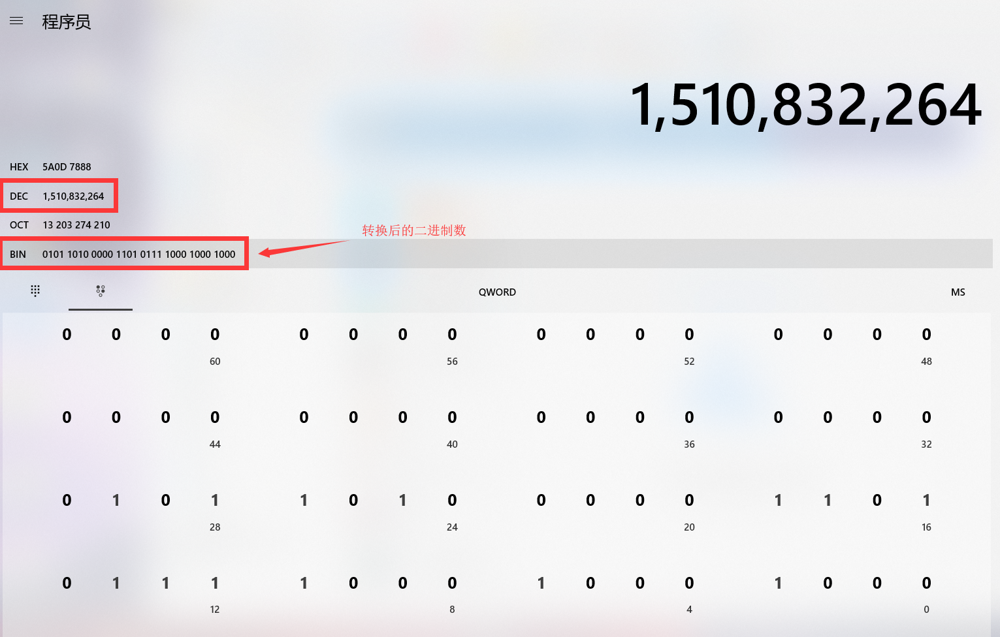
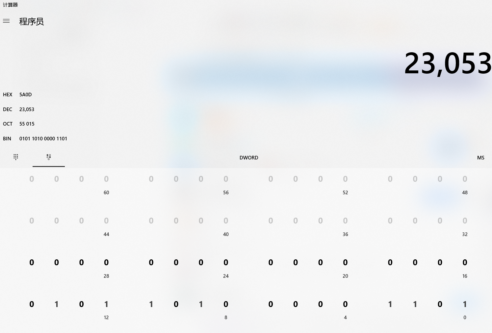
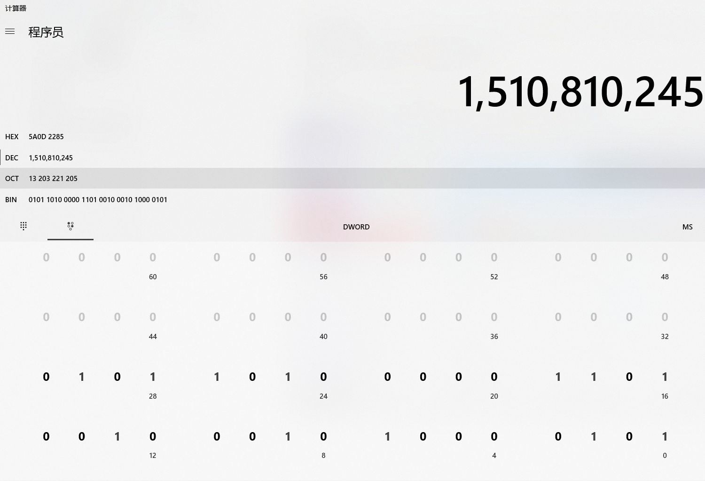

## 与、或、异或 和 hash算法

#### 1. 与（&）

- 一假则假

0 & 1 = 0

1 & 0 = 0

0 & 0 = 0

1 & 1 = 1


#### 2. 或（|）

- 一真则真

0 | 1 = 1

1 | 0 = 1

0 | 0 = 0

1 | 1 = 1


#### 3. 异或（^）

- 两边不一样则是真，一样则假

0 ^ 1 = 1

1 ^ 0 = 1

0 ^ 0 = 0

1 ^ 1 = 0


#### 4. hash（hashcode）算法

- java中hashcode，转换成32位bit，他的高16位和低16位进行异或运算，这个过程就叫hash算法

```java
public static void main(String[] args) {
    Integer hashKey = "1qwewq".hashCode();
    Integer hashKey2 = hashKey >>> 16;
   
    System.out.println(hashKey);// 1510832264
    System.out.println(hashKey2);// 23053
    System.out.println(hashKey ^ hashKey2);// 1510810245
}
```

**为什么异或后结果是1510810245呢**

1. 1510832264 二进制表示 0101 1010 0000 1101 0111 1000 1000 1000

2. 二进制向右移动16位，高位用0补齐。0000 0000 0000 0000 0101 1010 0000 1101（换成十进制23053）

3. 进行异或运算0101 1010 0000 1101 0111 1000 1000 1000 和 0000 0000 0000 0000 0101 1010 0000 1101

   0101 1010 0000 1101 0111 1000 1000 1000

   0000 0000 0000 0000 0101 1010 0000 1101

   结果

   0101 1010 0000 1101 0010 0010 1000 0101 （换成10进制1510810245）



