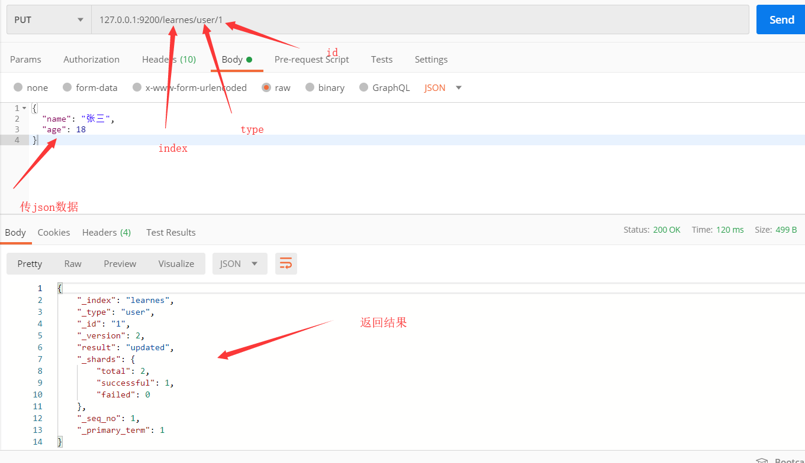
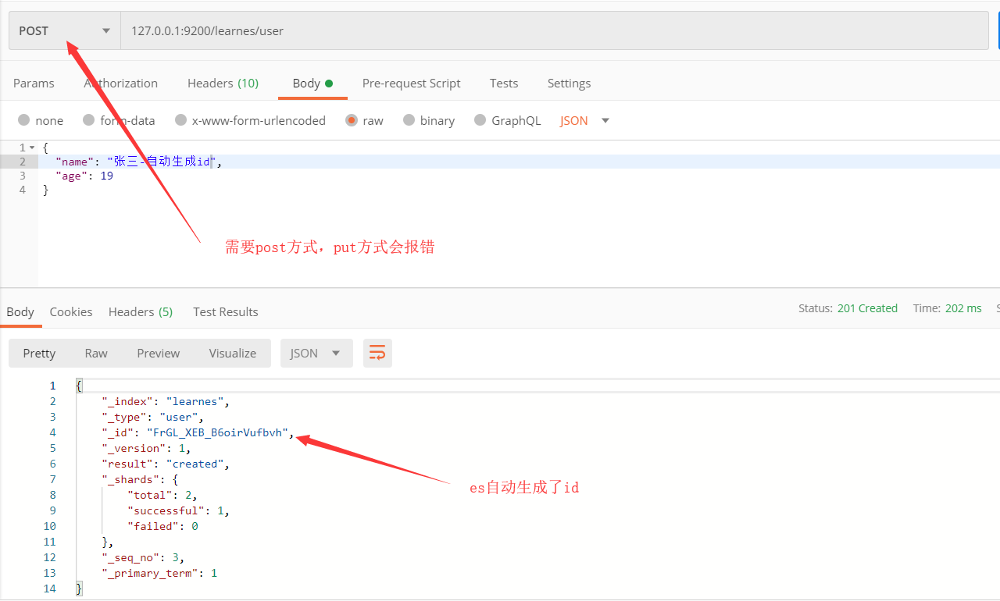
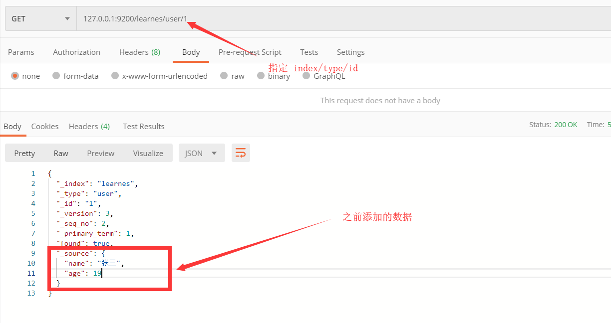
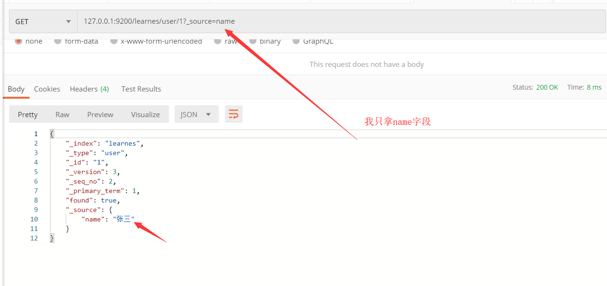
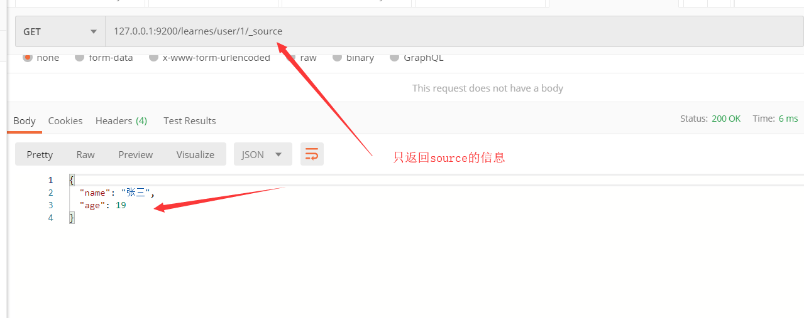
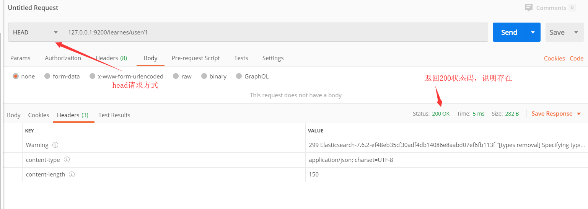
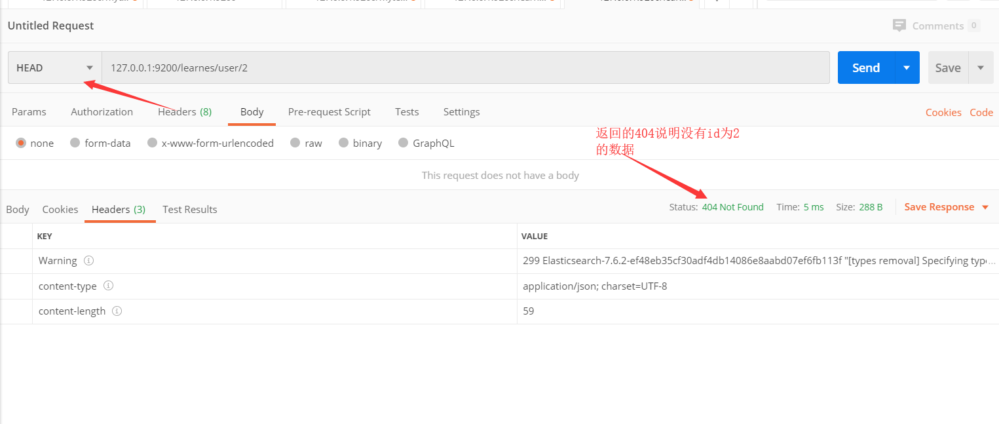
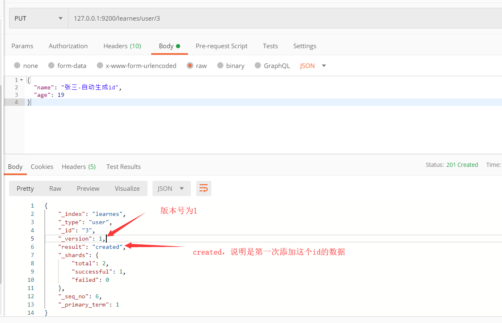

## elasticsearch学习笔记

#### 1. elasticsearch是什么？

*Elasticsearch* 是一个实时的分布式搜索分析引擎，它能让你以前所未有的速度和规模，去探索你的数据。 它被用作全文检索、结构化搜索、分析以及这三个功能的组合：

- Wikipedia 使用 Elasticsearch 提供带有高亮片段的全文搜索，还有 *search-as-you-type* 和 *did-you-mean* 的建议。
- *卫报* 使用 Elasticsearch 将网络社交数据结合到访客日志中，为它的编辑们提供公众对于新文章的实时反馈。
- Stack Overflow 将地理位置查询融入全文检索中去，并且使用 *more-like-this* 接口去查找相关的问题和回答。
- GitHub 使用 Elasticsearch 对1300亿行代码进行查询。


#### 2. 如何安装elasticsearch？

安装 Elasticsearch 之前，你需要先安装一个较新的版本的 Java，最好的选择是，你可以从 [*www.java.com*](http://www.java.com/) 获得官方提供的最新版本的 Java。

之后，你可以从 elastic 的官网 [*elastic.co/downloads/elasticsearch*](https://www.elastic.co/downloads/elasticsearch) 获取最新版本的 Elasticsearch。

安装运行，检测是否运行成功。

```
curl 'http://localhost:9200/?pretty'
```

返回结果

```json
{
    "name": "DESKTOP-L0NUB1S",
    "cluster_name": "elasticsearch",
    "cluster_uuid": "8vKmPJXSR068dvZhjigM4g",
    "version": {
        "number": "7.6.2",
        "build_flavor": "default",
        "build_type": "zip",
        "build_hash": "ef48eb35cf30adf4db14086e8aabd07ef6fb113f",
        "build_date": "2020-03-26T06:34:37.794943Z",
        "build_snapshot": false,
        "lucene_version": "8.4.0",
        "minimum_wire_compatibility_version": "6.8.0",
        "minimum_index_compatibility_version": "6.0.0-beta1"
    },
    "tagline": "You Know, for Search"
}
```


#### 3. 文档元数据

一个文档不仅仅包含它的数据 ，也包含 *元数据* —— *有关* 文档的信息。 三个必须的元数据元素如下：

- **`_index`** （类似mysql的数据库）

  文档在哪存放

- **`_type`** （类似mysql数据库里的表）

  文档表示的对象类别

- **`_id`** （类似mysql表里的行数据）

  文档唯一标识


#### 4. 索引文档 （添加一条数据）

通过使用 `index` API ，文档可以被 *索引* —— 存储和使文档可被搜索。 但是首先，我们要确定文档的位置。正如我们刚刚讨论的，一个文档的 `_index` 、 `_type` 和 `_id` 唯一标识一个文档。 我们可以提供自定义的 `_id` 值，或者让 `index` API 自动生成。

##### 使用自定义的 ID

如果你的文档有一个自然的标识符 （例如，一个 `user_account` 字段或其他标识文档的值），你应该使用如下方式的 `index` API 并提供你自己 `_id` ：

```js
PUT /{index}/{type}/{id}
{
  "field": "value",
  ...
}
```



##### Autogenerating IDs (自动生成的id)

如果你的数据没有自然的 ID， Elasticsearch 可以帮我们自动生成 ID 。 请求的结构调整为： 不再使用 `PUT` 谓词(“使用这个 URL 存储这个文档”)， 而是使用 `POST` 谓词(“存储文档在这个 URL 命名空间下”)。

现在该 URL 只需包含 `_index` 和 `_type` :

```js
POST /website/blog/
{
  "title": "My second blog entry",
  "text":  "Still trying this out...",
  "date":  "2014/01/01"
}
```

使用自动需要使用POST方式，put方式会报错

```
{
    "error": "Incorrect HTTP method for uri [/learnes/user] and method [PUT], allowed: [POST]",
    "status": 405
}
```




#### 5. 取回文档 （获取数据）

##### 获取一条数据

为了从 Elasticsearch 中检索出文档，我们仍然使用相同的 `_index` , `_type` , 和 `_id` ，但是 HTTP 谓词更改为 `GET` :

```sense
GET /website/blog/123?pretty
```



##### 获取文档指定字段

默认情况下， `GET` 请求会返回整个文档，这个文档正如存储在 `_source` 字段中的一样。但是也许你只对其中的 `title` 字段感兴趣。单个字段能用 `_source` 参数请求得到，多个字段也能使用逗号分隔的列表来指定。

```sense
GET /website/blog/123?_source=title,text
```



或者，如果你只想得到 `_source` 字段，不需要任何元数据，你能使用 `_source` 端点：

```sense
GET /website/blog/123/_source
```




#### 6. 检测文档是否存在

如果只想检查一个文档是否存在--根本不想关心内容—那么用 `HEAD` 方法来代替 `GET` 方法。 `HEAD` 请求没有返回体，只返回一个 HTTP 请求报头：

```js
curl -i -XHEAD http://localhost:9200/website/blog/123
```

如果文档存在， Elasticsearch 将返回一个 `200 ok` 的状态码：

```js
HTTP/1.1 200 OK
Content-Type: text/plain; charset=UTF-8
Content-Length: 0
```

若文档不存在， Elasticsearch 将返回一个 `404 Not Found` 的状态码：

```js
curl -i -XHEAD http://localhost:9200/website/blog/124
```

```js
HTTP/1.1 404 Not Found
Content-Type: text/plain; charset=UTF-8
Content-Length: 0
```


postman中，之前添加过id1的数据。但是没有id2的数据。






#### 7. 更新整个文档 （修改数据）

在 Elasticsearch 中文档是 *不可改变* 的，不能修改它们。相反，如果想要更新现有的文档，需要 *重建索引* 或者进行替换， 我们可以使用相同的 `index` API 进行实现

```sense
PUT /website/blog/123
{
  "title": "My first blog entry",
  "text":  "I am starting to get the hang of this...",
  "date":  "2014/01/02"
}
```

在响应体中，我们能看到 Elasticsearch 已经增加了 `_version` 字段值：

```js
{
  "_index" :   "website",
  "_type" :    "blog",
  "_id" :      "123",
  "_version" : 2,
  "created":   false 
}
```

`created` 标志设置成 `false` ，是因为相同的索引、类型和 ID 的文档已经存在。





#### 8. 创建新文档 （避免重复添加）

当我们索引一个文档，怎么确认我们正在创建一个完全新的文档，而不是覆盖现有的呢？

请记住， `_index` 、 `_type` 和 `_id` 的组合可以唯一标识一个文档。所以，确保创建一个新文档的最简单办法是，使用索引请求的 `POST` 形式让 Elasticsearch 自动生成唯一 `_id` :

```js
POST /website/blog/
{ ... }
```


然而，如果已经有自己的 `_id` ，那么我们必须告诉 Elasticsearch ，只有在相同的 `_index` 、 `_type` 和 `_id` 不存在时才接受我们的索引请求。这里有两种方式，他们做的实际是相同的事情。使用哪种，取决于哪种使用起来更方便。

第一种方法使用 `op_type` 查询-字符串参数：

```js
PUT /website/blog/123?op_type=create
{ ... }
```


第二种方法是在 URL 末端使用 `/_create` :

```js
PUT /website/blog/123/_create
{ ... }
```


如果创建新文档的请求成功执行，Elasticsearch 会返回元数据和一个 `201 Created` 的 HTTP 响应码。

另一方面，如果具有相同的 `_index` 、 `_type` 和 `_id` 的文档已经存在，Elasticsearch 将会返回 `409 Conflict` 响应码，以及如下的错误信息：

```sense
{
   "error": {
      "root_cause": [
         {
            "type": "document_already_exists_exception",
            "reason": "[blog][123]: document already exists",
            "shard": "0",
            "index": "website"
         }
      ],
      "type": "document_already_exists_exception",
      "reason": "[blog][123]: document already exists",
      "shard": "0",
      "index": "website"
   },
   "status": 409
}
```