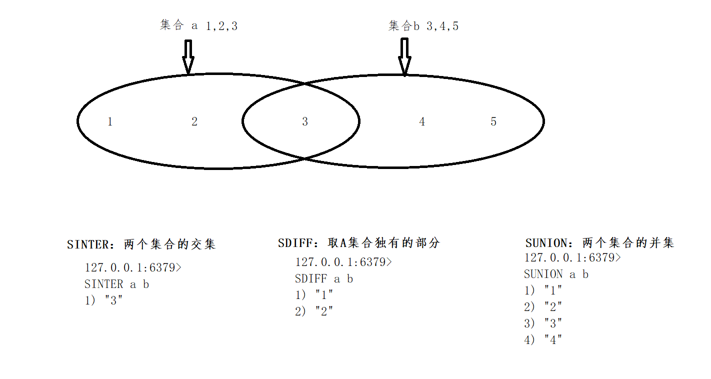

## Redis Set 笔记

#### 1. **SADD key member [member ...]**

- 将一个或多个 `member` 元素加入到集合 `key` 当中，已经存在于集合的 `member` 元素将被忽略。
- 假如 `key` 不存在，则创建一个只包含 `member` 元素作成员的集合。
- 当 `key` 不是集合类型时，返回一个错误。

> **Set 会自动去重**
>
> ```
> 127.0.0.1:6379> SADD a 1 1 2 3 4
> (integer) 4
> 127.0.0.1:6379> SMEMBERS a
> 1) "1"
> 2) "2"
> 3) "3"
> 4) "4"
> ```
>
> **已存在的会继续添加**
>
> ```
> 127.0.0.1:6379> sadd a 4 5 6
> (integer) 2
> 127.0.0.1:6379> SMEMBERS a
> 1) "1"
> 2) "2"
> 3) "3"
> 4) "4"
> 5) "5"
> 6) "6"
> ```


#### 2. **SPOP key**

- 移除并返回集合中的一个随机元素。
- 如果只想获取一个随机元素，但不想该元素从集合中被移除的话，可以使用 [*SRANDMEMBER*](http://doc.redisfans.com/set/srandmember.html#srandmember) 命令。

> **随机移除的数据，并非有序**
>
> ```
> 127.0.0.1:6379> sadd a 1 2 3 4 5 6
> (integer) 6
> 127.0.0.1:6379> spop a 1
> 1) "4"
> 127.0.0.1:6379> spop a 1
> 1) "3"
> 127.0.0.1:6379> spop a 1
> 1) "1"
> ```


#### 3. **SRANDMEMBER key [count]** (和SPOP类似，SPOP会清除元素。SRANDMEMBER则不会清除)

- 如果命令执行时，只提供了 `key` 参数，那么返回集合中的一个随机元素。
- 从 Redis 2.6 版本开始， [SRANDMEMBER](http://doc.redisfans.com/set/srandmember.html#srandmember) 命令接受可选的 `count` 参数：
- - 如果 `count` 为正数，且小于集合基数，那么命令返回一个包含 `count` 个元素的数组，数组中的元素**各不相同**。如果 `count` 大于等于集合基数，那么返回整个集合。
  - 如果 `count` 为负数，那么命令返回一个数组，数组中的元素**可能会重复出现多次**，而数组的长度为 `count` 的绝对值。
- 该操作和 [*SPOP*](http://doc.redisfans.com/set/spop.html#spop) 相似，但 [*SPOP*](http://doc.redisfans.com/set/spop.html#spop) 将随机元素从集合中移除并返回，而 [SRANDMEMBER](http://doc.redisfans.com/set/srandmember.html#srandmember) 则仅仅返回随机元素，而不对集合进行任何改动。

> **count > 0情况**
>
> ```
> 127.0.0.1:6379> sadd a 1 2 3 4 5
> (integer) 5
> 127.0.0.1:6379> SRANDMEMBER a 2
> 1) "3"
> 2) "1"
> 127.0.0.1:6379> SMEMBERS a
> 1) "1"
> 2) "2"
> 3) "3"
> 4) "4"
> 5) "5"
> ```
>
> **count < 0情况，会出现负数重复元素**
>
> ```
> 127.0.0.1:6379> sadd a 1 2 3 4 5
> (integer) 5
> 127.0.0.1:6379> SRANDMEMBER a -10
>  1) "5"
>  2) "2"
>  3) "2"
>  4) "3"
>  5) "2"
>  6) "2"
>  7) "2"
>  8) "4"
>  9) "3"
> 10) "3"
> ```
>
> **count > 集合长度 情况**
>
> ```
> 127.0.0.1:6379> sadd a 1 2 3 4 5
> (integer) 5
> 127.0.0.1:6379> SRANDMEMBER a 7
> 1) "1"
> 2) "2"
> 3) "3"
> 4) "4"
> 5) "5"
> ```


#### 4. **SCARD key**

- 返回集合 `key` 的基数(集合中元素的数量)。

> **类似list 计算数量多少**
>
> ```
> 127.0.0.1:6379> sadd b 1 2 4
> (integer) 3
> 127.0.0.1:6379> SCARD b
> (integer) 3
> ```


#### 5. **SREM key member [member ...]**

- 移除集合 `key` 中的一个或多个 `member` 元素，不存在的 `member` 元素会被忽略。
- 当 `key` 不是集合类型，返回一个错误。

> ```
> 127.0.0.1:6379> sadd a 1 2 3 4 5
> (integer) 5
> 127.0.0.1:6379> SREM a 3 5 7 8
> (integer) 2
> 127.0.0.1:6379> SMEMBERS a
> 1) "1"
> 2) "2"
> 3) "4"
> ```


#### 6. **SMOVE source destination member**

- 将 `member` 元素从 `source` 集合移动到 `destination` 集合。
- [SMOVE](http://doc.redisfans.com/set/smove.html#smove) 是原子性操作。
- 如果 `source` 集合不存在或不包含指定的 `member` 元素，则 [SMOVE](http://doc.redisfans.com/set/smove.html#smove) 命令不执行任何操作，仅返回 `0` 。否则， `member` 元素从 `source` 集合中被移除，并添加到 `destination` 集合中去。
- 当 `destination` 集合已经包含 `member` 元素时， [SMOVE](http://doc.redisfans.com/set/smove.html#smove) 命令只是简单地将 `source` 集合中的 `member` 元素删除。
- 当 `source` 或 `destination` 不是集合类型时，返回一个错误。

> **正常移动一个元素**
>
> ```
> 127.0.0.1:6379> sadd a 1 2 3
> (integer) 3
> 127.0.0.1:6379> sadd b 3 4 5
> (integer) 3
> 127.0.0.1:6379> SMOVE a b 2
> (integer) 1
> 127.0.0.1:6379> SMEMBERS b
> 1) "2"
> 2) "3"
> 3) "4"
> 4) "5"
> ```
>
> **接着上面，移动一个B已经有的元素，a相当于是 spop**
>
> ```
> 127.0.0.1:6379> SMOVE a b 3
> (integer) 1
> 127.0.0.1:6379> SMEMBERS b
> 1) "2"
> 2) "3"
> 3) "4"
> 4) "5"
> 127.0.0.1:6379> SMEMBERS a
> 1) "1"
> ```


#### 7. **SISMEMBER key member**

- 判断 `member` 元素是否集合 `key` 的成员。

> ```
> 127.0.0.1:6379> sadd a 1 2 33
> (integer) 3
> 127.0.0.1:6379> SISMEMBER a 2
> (integer) 1
> 127.0.0.1:6379> SISMEMBER a 5
> (integer) 0
> ```


#### 8. **SMEMBERS key**

- 返回集合 `key` 中的所有成员。
- 不存在的 `key` 被视为空集合。

> ```
> 127.0.0.1:6379> sadd a 1 2 33
> (integer) 3
> 127.0.0.1:6379> SMEMBERS a
> 1) "1"
> 2) "2"
> 3) "33"
> ```


#### 9. SDIFF 和 SINTER 和 SUNION 图解

**SDIFFSTORE 和 SINTERSTORE 和 SUNIONSTORE，只是把提取出来的结果保存到一个集合里面** 




#### 10. **SINTER key [key ...]** 和 **SINTERSTORE destination key [key ...]**

**SINTER key [key ...]**

- 返回一个集合的全部成员，该集合是所有给定集合的交集。
- 不存在的 `key` 被视为空集。
- 当给定集合当中有一个空集时，结果也为空集(根据集合运算定律)。

**SINTERSTORE destination key [key ...]**

- 这个命令类似于 [*SINTER*](http://doc.redisfans.com/set/sinter.html#sinter) 命令，但它将结果保存到 `destination` 集合，而不是简单地返回结果集。
- 如果 `destination` 集合已经存在，则将其覆盖。
- `destination` 可以是 `key` 本身。


#### 11. **SDIFF key [key ...]**  和 **SDIFFSTORE destination key [key ...]**

**SDIFF key [key ...]**

- 返回一个集合的全部成员，该集合是所有给定集合之间的差集。
- 不存在的 `key` 被视为空集。

**SDIFFSTORE destination key [key ...]**

- 这个命令的作用和 [*SDIFF*](http://doc.redisfans.com/set/sdiff.html#sdiff) 类似，但它将结果保存到 `destination` 集合，而不是简单地返回结果集。
- 如果 `destination` 集合已经存在，则将其覆盖。
- `destination` 可以是 `key` 本身。


#### 12. **SUNION key [key ...] **和 **SUNIONSTORE destination key [key ...]**

**SUNION key [key ...]**

- 返回一个集合的全部成员，该集合是所有给定集合的并集。
- 不存在的 `key` 被视为空集。

**SUNIONSTORE destination key [key ...]**

- 这个命令类似于 [*SUNION*](http://doc.redisfans.com/set/sunion.html#sunion) 命令，但它将结果保存到 `destination` 集合，而不是简单地返回结果集。
- 如果 `destination` 已经存在，则将其覆盖。
- `destination` 可以是 `key` 本身。


#### 13. **SSCAN key cursor [MATCH pattern] [COUNT count]** （2020年5月17日，暂时不考虑）

- 详细信息请参考 [*SCAN*](http://doc.redisfans.com/key/scan.html#scan) 命令。