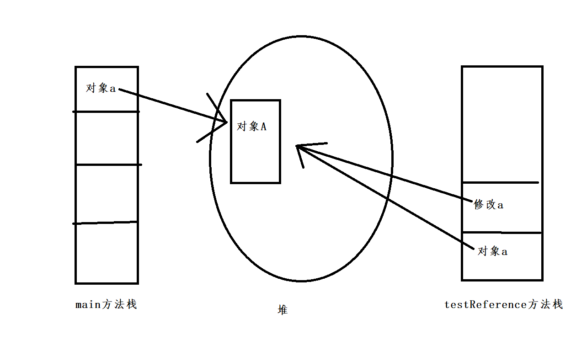
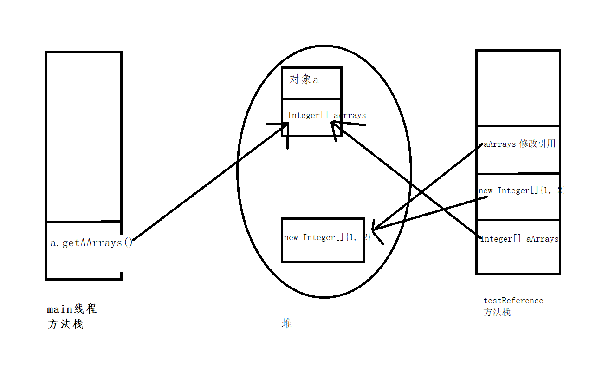

## 引用类型、值传递类型

**8种基本类型，值传递**

**其他类型，引用传递**

**测试类**

```java
package com.learn.othercode.learn.jdbcspace;

import lombok.Data;

@Data
class A {
    private Integer aInteger = 0;
    private String aString = "0";

    private Integer[] aArrays = {0, 1};
}

public class Test {
    public static void main(String[] args) {
        A a = new A();
        testReference(a.getAInteger(), a.getAString(), a.getAArrays());
        System.out.println(a.toString());
        System.out.println("***********************");
        testReference(a);
        System.out.println(a.toString());
    }

    /**
     * 为什么修改 A a，影响到原有的A类呢
     *
     * @param a
     */
    public static void testReference(A a) {
        a.setAInteger(1);
        a.setAString("1");
        a.setAArrays(new Integer[]{1, 2});
    }

    /**
     * 为什么修改 Integer[] aArrays类型没有影响到，原有的A类呢
     *
     * @param aInteger
     * @param aString
     * @param aArrays
     */
    public static void testReference(Integer aInteger, String aString, Integer[] aArrays)     {
        aInteger = 1;
        aString = "1";
        aArrays = new Integer[]{1, 2};
    }
}

```

```
A(aInteger=0, aString=0, aArrays=[0, 1])
***********************
A(aInteger=1, aString=1, aArrays=[1, 2])
```

**为什么修改 A a，影响到原有的A类呢**

- testReference(a)，新创建一个testReference方法栈，把a的引用指向了main的a
- 修改testReference方法栈，就实际上是修改了 main对象a



**为什么修改 Integer[] aArrays类型没有影响到，原有的A类呢**

- 新创建一个testReference方法栈，把`a`对象`aArrays` 的引用给了`testReference方法栈`的`aArrays` 
- new Integer[]{1, 2}，然后把`testReference方法栈`的`aArrays` 指向了这个新new的数组
- 并没有影响到原有的main线程的对象

