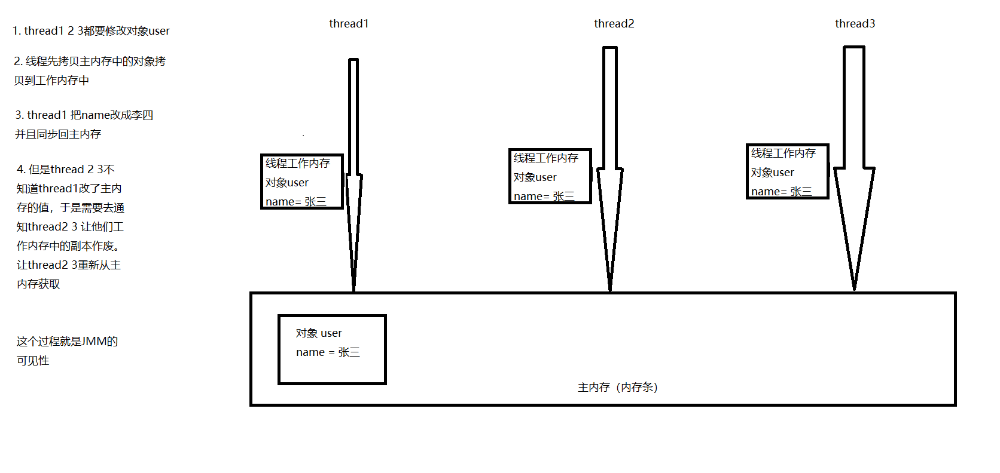

## JMM

**什么是JMM**

JMM（java内存模型 java memory model），JMM是一种`抽象的概念`本质并不存在，它描述的是一种规则或是规范。这个规范定义了程序各个变量（包括实例字段，静态字段等等）的访问方式

**JMM三大特性**

- 可见性
- 原子性
- 有序性

**JMM关于线程同步规定**

- 线程加锁前，需要把主内存中的变量，复制到自己线程的工作内存中
- 线程解锁前，把工作内存中的变量同步回给主内存
- 加锁解锁是同一把

由于JVM运行程序的实体是线程，而每个线程创建时，JVM会为其创建一个工作空间（栈空间）。工作空间是`线程私有`的，而java内存模型中规定所有变量都是存放在`主内存`中，主内存是共享线程区域，所有线程都可以访问。`但是线程对变量的操作（读取赋值等）需要在工作内存中进行，于是首先把变量从主内存中拷贝到工作内存中，然后对变量进行操作，操作结束后再把变量写回主内存`，不能直接操作主内存中的变量，各个线程中的工作内存存储着主内存的`变量副本`，因此不同线程间是不能访问对方的工作空间，线程间的通信（传值）需要通过主内存来完成。

**图解**

